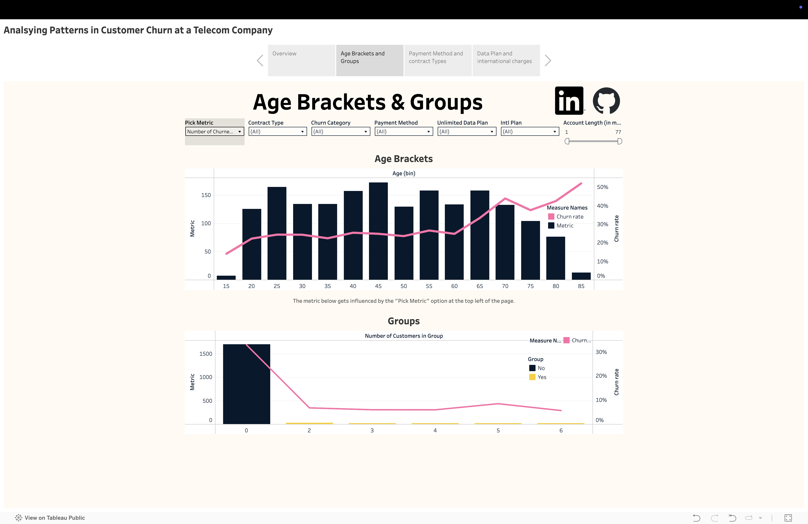
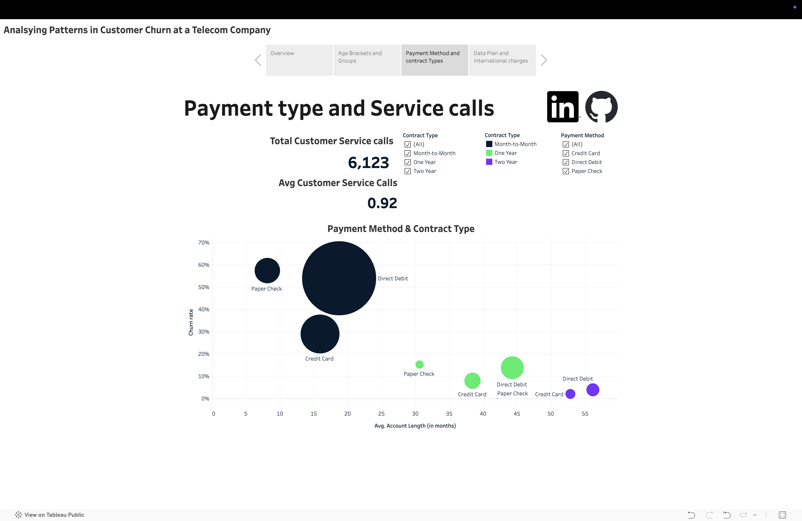
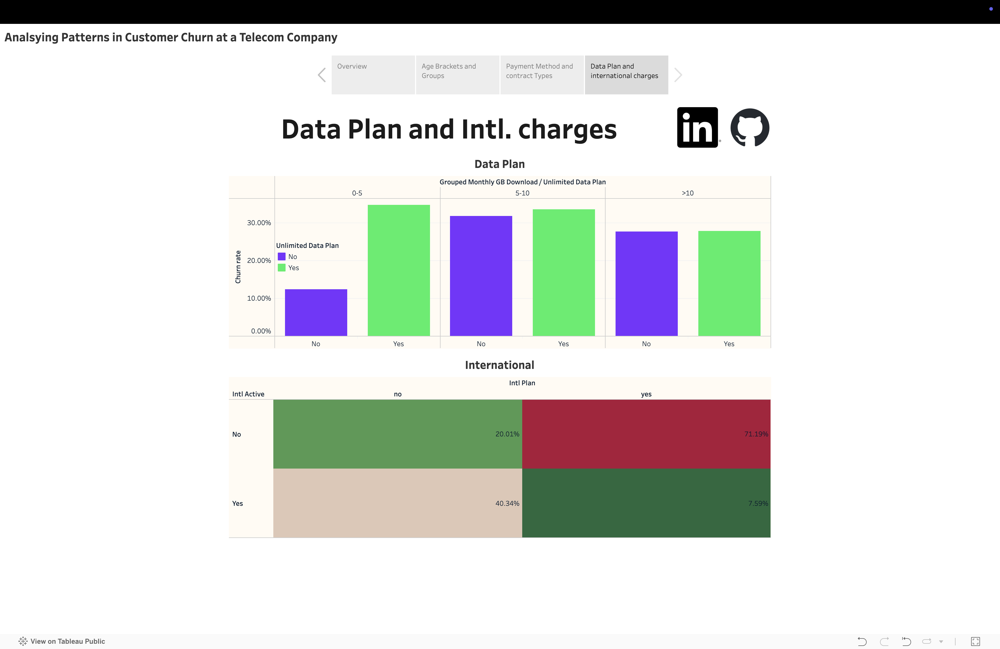

# 📊 Analysing Customer Churn with Tableau 

## 🔍 Project Overview

Investigated a dataset from an fictional telecom company called Databel and analyze their churn rates. Analyzing churn doesn’t just mean knowing what the churn rate is: it’s also about figuring out why customers are churning at the rate they are, and how to reduce churn. Answered these questions by creating calculated fields and various visualizations in Tableau, such as dual-axis graphs and scatter plots. Made graphs dynamic by using filters and parameters, and combined everything into a story to share your insights.

This project focuses on analyzing why customers are churning. The goal is to transform raw data into meaningful insights through visually compelling dashboards that support data-driven decision-making.

## 📁 Contents

- **[Tableau File](Customer_Churn.twbx)** – Tableau file with sheets, dashboards and story
- **[Data](Databel-Data.csv)** – Raw and cleaned datasets (CSV or Excel)
- **README.md** – You're here!
- [**Tableau Public Link**](https://public.tableau.com/app/profile/chiranjeevi.nalapalu/viz/Customer_Churn_17448109441080/Summary) – Direct access to the interactive dashboard

## 🌐 Live Dashboard

👉 [**View the Dashboard on Tableau Public**](https://public.tableau.com/app/profile/chiranjeevi.nalapalu/viz/Customer_Churn_17448109441080/Summary)

## 🛠 Tools & Technologies

- **Tableau Desktop/Public** – For building and publishing dashboards
- **Excel** – Data preprocessing

## 📊 Key Visualizations

- 📍 **Age Brackets and Groups** – Interactive dashboard showing a distribution of different metrics(count of service calls, customers) in different age and group number brackets. With filters for payment method, international plan, account length etc. 

- 📍 **Payment Method and contract Types** – Scatter plot of Churn rate vs account length for different mayment methods and contract types with text fields diplaying total and average service calls.  

- 📍 **Data Plan and international charges** – Highlight table and grouped bar chart showing churn rate as a fuction of international charges and data plan

## 🧠 Insights & Takeaways

- 🔹 Insight 1: Total Churn Rate was 26.86% and the leading cause of Churn was competitors making better offers
- 🔹 Insight 2: The state with the highest Churn rate was California with amjority of customers being on a month to month contract 
- 🔹 Insight 3: Churn rates were higher in older customers but lower in youger people and for people who were part of a family/group plan. 

## 💡 Future Improvements

- Add drill-down capabilities
- Integrate dynamic parameters for more interactivity
- Expand dataset for longitudinal trends

## 📫 Let's Connect!

If you have any feedback or would like to collaborate, feel free to reach out:

- [LinkedIn](https://www.linkedin.com/in/nalapalu/)
- [Portfolio Website](https://www.datascienceportfol.io/nalapalu)
- Email: [chiran.nalapalu@gmail.com](chiran.nalapalu@gmail.com)

---

Thanks for checking out my Tableau project!
